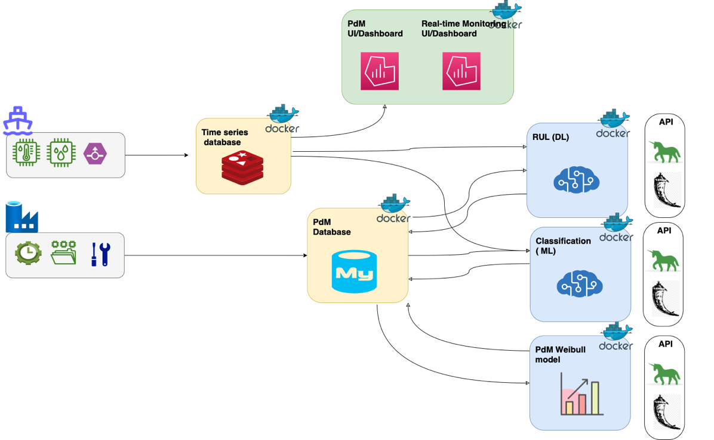

# podium : A Data-Driven (ML/AI based) prediction for defects of maritime vessels main engine 

## Description
This repository is based  on the work done within the KICS project and incorporates our paper with title: 
["Predictive maintenance leveraging machine
learning for time-series forecasting in the maritime
industry"](https://ieeexplore.ieee.org/abstract/document/9294450) [1], and it can be used on vessel Iot data
from sensors installed on a main engine of a vessel. 
Feel free to reuse, modify and extend this repository.

## podium framework
Multi-nilm is a novel framework for efficient explanation of ML outputs applied on manufacturing data. 
It has 3 main parts:
- It provides a set notebooks for didactic purposes for timeseries analysis and predictive maintenance.
- It provides a classifier for classifying the status of a main engine of a vessel as (normal and non-normal).
- It provides a RUL estimator based on a probabilistic RNN.




[//]: # (## Examples)

[//]: # (Examples of experiments can be found under the directory _experiments_. )

[//]: # (The module [experiments.py]&#40;experiments/experiments.py&#41; defines three types of experiments &#40;_GenericExperiment, ModelSelectionExperiment_ )

[//]: # (and _REDDModelSelectionExperiment_&#41;. You can also create your own )

[//]: # (experiment by extending the abstract class _nilmlab.lab.Experiment_.)

[//]: # (After defining an experiment it requires only a few lines of code to setup and configure it. )

[//]: # (All files with names _run*.py_ are specific implementations that can be used as a reference.)

[//]: # (In order to run any of them it is as simple as: )

[//]: # (```python)

[//]: # (python -m experiments.run_generic_experiment)

[//]: # (```)

[//]: # (The results are saved under the directory _results_ as a csv file containing information about the )

[//]: # (setup, the source of the data, the parameters, the classification models, the performance and others.)

## Data

Τα δεδομένα που χρησιμοποιήθηκαν στην δημιουργία του εργαλείου διατέθηκαν
από μια ναυτιλιακή εταιρεία που συγκεντρώνει ροές δεδομένων από όλους τους
αισθητήρες που χρησιμοποιούνται στα πλοία. Κάθε ροή παριστάνει τις ιστορικές εγγραφές
που συλλέγονται με το χρόνο από έναν συγκεκριμένο αισθητήρα στο πλοίο. Όλα αυτά
δειγματοληπτούνται βασισμένα σε χρονική περίοδο ενός λεπτού ή δέκα λεπτών. Αυτά
επίσης όταν χρησιμοποιούνται σαν είσοδοι των μοντέλων αναφέρονται και ως
«χαρακτηριστικά» και παρουσιάζονται περιληπτικά στον παρακάτω Πίνακας 1 . Το σύνολο
των διαθέσιμων δεδομένων αφορά ιστορικά δεδομένα από 10 πλοία ίδιου τύπου.
Πλέον των ανωτέρω δεδομένων αισθητήρων, είναι απαιτητά τα δεδομένα (χρονικές
στιγμές) εμφάνισης μιας συγκεκριμένης βλάβης διετέθησαν. Η βλάβη αφορά στη φθορά
του ρουλεμάν σταυρού κεφαλής που συνήθως οφείλεται στην πορεία των πλοίων με
μικρότερη ταχύτητα από τα προβλεπόμενα για λόγους μείωσης του κόστους. Η
μεθοδολογία του παρόντος εργαλείου έχει βασιστεί στο συγκεκριμένο σύνολο δεδομένων.
Πρέπει να σημειωθεί ότι η προτεινόμενη μεθοδολογία απαιτεί τροποποίηση για να
εφαρμοστεί σε διαφορετικό σύνολο δεδομένων σε διαφορετική εταιρία.


## Project structure
A detailed structure of the project is presented below. The key points are:
   - 📂 __examples__: Contains helpful notebooks for didactic purposes.
   - 📂 __files__: Includes modules related to data e.g. loading, processing labels and others. 
   - 📂 __podium\_classifier__: Contains all the files needed to build the docker image for the Podium Status classifier . 
   - 📂 __podium\rul\estimator__: Contains all the files needed to build the docker image for the Podium RUL Estimator


- 📂 __multi\-nilm__
   - 📄 [LICENSE](LICENSE)
   - 📄 [README.md](README.md)
   - 📄 [requirements.txt](requirements.txt)
   - 📂 __examples__: 
     - 📄 [\_\_init\_\_.py](examples/__init__.py)
     - 📄 [Predictive\_Maintenance\_KICS.ipynb](examples/Predictive_Maintenance_KICS.ipynb)
     - 📄 [TimeSeries\_practical\_course.ipynb](examples/TimeSeries_practical_course.ipynb))
   - 📂 __files__
   - 📂 __podium\_classifier__
     - 📄 [\_\_init\_\_.py](podium_classifier/__init__.py)
     - 📄 [Config.py](podium_classifier/Config.py)
     - 📄 [Dockerfile](podium_classifier/Dockerfile)
     - 📄 [Iot.py](podium_classifier/Iot.py)
     - 📄 [main.py](podium_classifier/main.py)
     - 📄 [MasterCategories.py](podium_classifier/MasterCategories.py)
     - 📄 [requirements.txt](podium_classifier/requirements.txt)
     - 📄 [step_funtions.py](podium_classifier/step_funtions.py)
   - 📂 __podium\_rul\_estimator__
     - 📄 [\_\_init\_\_.py](podium_rul_estimator/__init__.py)
     - 📄 [Config.py](podium_rul_estimator/Config.py)
     - 📄 [Dockerfile](podium_rul_estimator/Dockerfile)
     - 📄 [main.py](podium_rul_estimator/main.py)
     - 📄 [requirements.txt](podium_rul_estimator/requirements.txt)
     - 📄 [step_funtions.py](podium_rul_estimator/step_funtions.py)


## Dependencies

The code has been developed using python3.6 and the dependencies can be found in [requirements.txt](requirements.txt).
- numpy~=1.21.5
- opencv-python~=4.5.5.64
- tensorflow~=2.9.1
- loguru~=0.4.1
- scikit-image~=0.19.2
- pandas 1.1.5 : Ανάλυση δεδομένων
- numpy 1.19.5 : Μαθηματικές συναρτήσεις
- scikit-learn 0.24.1 : Προγνωστική ανάλυση δεδομένων
- scipy 1.5.4 : Μαθηματικές συναρτήσεις
- xgboost 1.3.3 : Ισχυρός ταξινομητής δεδομένων
- reliability 0.8.3 : Μηχανική αξιοπιστίας και ανάλυση επιβίωσης
- tensorflow 2.7.1 : Μοντέλα Μηχανικής και Βαθιάς Μάθησης
- Flask 1.1.2 : Εφαρμογές REST
- Werkzeug 2.0.0 : Διεπαφή πύλης διακομιστή web για ανάπτυξη 
- gunicorn 20.0.4 : Διεπαφή πύλης διακομιστή web για παραγωγή


## Γνωστοποίηση / Αποποίηση Ευθύνης

Η ομάδα έργου, δεδομένου ότι η κατασκευή του εργαλείου βασίστηκε σε δεδομένα μη
προτυποποιημένα και χωρίς την επαλήθευση τους από κάποιο φορέα, δεν ευθύνεται για
οιαδήποτε άμεση, έμμεση, ειδική, περαιτέρω, ζημία, ποινικές ρήτρες ή αποζημίωση
παραδειγματικού χαρακτήρα, συμπεριλαμβανομένων των διαφυγόντων κερδών σε
οποιαδήποτε περίπτωση, που προκύπτουν ενδεικτικά από (i) τυχόν ελαττώματα, ιούς και
άλλες δυσλειτουργίες που προκαλούνται από τον εξοπλισμό και άλλο λογισμικό που
συνδέεται με την πρόσβαση ή τη χρήση του δικτυακού τόπου (ii) τις παρεχόμενες από
την εφαρμογή ή μέσω αυτής πληροφορίες (iii) την υποκλοπή, αλλοίωση ή τη
λανθασμένη χρήση των πληροφοριών που διαβιβάστηκαν στην εφαρμογή, (iv) τη
λειτουργία ή τη μη διαθεσιμότητα του παρόντος προιόντος, (v) τη λανθασμένη χρήση
του παρόντος, (vi) την απώλεια δεδομένων, (vii) τη μεταφόρτωση ή τη χρήση λογισμικού
που διατίθεται από τον παρόν προιόν, ή (viii) από αξιώσεις τρίτων σχετικά με τη χρήση
του παρόντος.

## Licence

This project is licensed under the MIT License - see the [LICENSE](LICENSE) file for details


## References

1. G. Makridis, D. Kyriazis and S. Plitsos, "Predictive maintenance leveraging machine learning for time-series forecasting in the maritime industry," 2020 IEEE 23rd International Conference on Intelligent Transportation Systems (ITSC), 2020, pp. 1-8, doi: 10.1109/ITSC45102.2020.9294450
